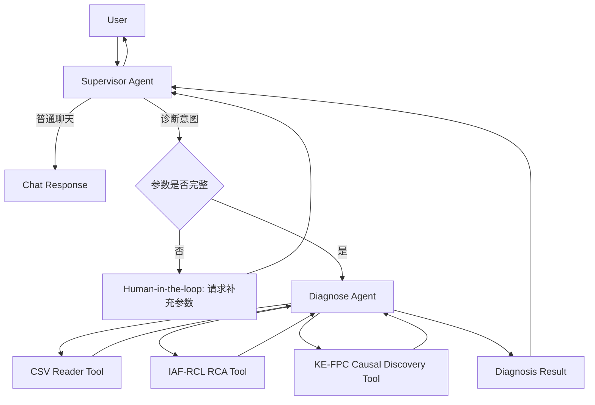
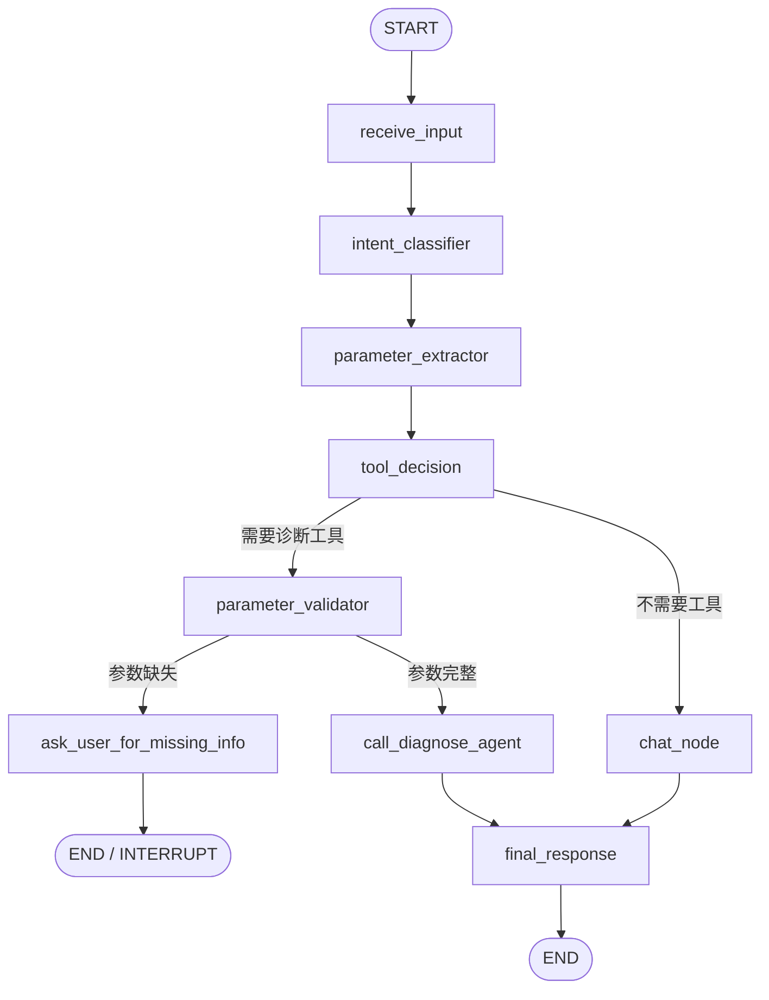
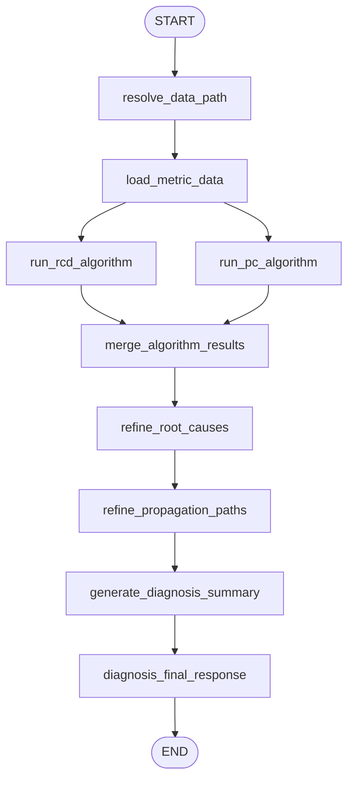
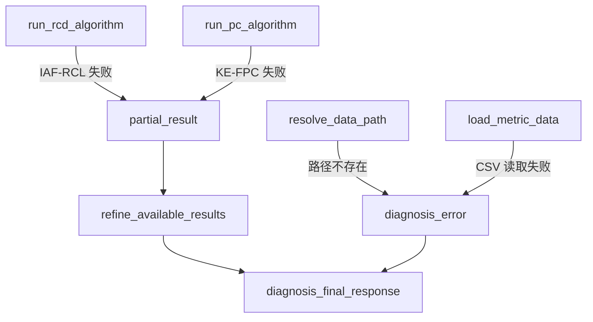

# AIOps Agent 系统设计文档

## 1. 文档信息

| 项目 | 内容 |
|---|---|
| 项目名称 | AIOps Agent |
| 文档类型 | 系统设计文档 |
| 当前版本 | v0.1 |
| 当前阶段 | 第一版 MVP |
| 核心范围 | Supervisor Agent + Diagnose Agent |
| 技术框架 | LangGraph / Python |
| 调试方式 | `main.py` 本地调试 + LangGraph Studio 可视化调试 |

---

## 2. 设计目标

本项目旨在构建一个面向智能运维场景的多智能体系统。系统以 `Supervisor Agent` 作为总控入口，根据用户输入识别意图、编排工具和子智能体；以 `Diagnose Agent` 作为第一阶段核心能力，完成系统指标数据读取、根因推理算法调用、根因指标和故障传播路径整合，最终输出可解释的根因诊断结果。

第一版本优先实现以下能力：

1. `Supervisor Agent`
   - 分析用户意图。
   - 判断是否需要调用工具或子智能体。
   - 编排 `Diagnose Agent` 等工具。
   - 当工具参数缺失时触发 Human-in-the-loop，向用户请求补充信息。
   - 当不需要调用工具时，直接与用户进行普通对话。

2. `Diagnose Agent`
   - 读取本地系统指标数据集。
   - 调用 IAF-RCL 根因推理算法工具。
   - 调用 KE-FPC 根因推理算法工具。
   - 整合 IAF-RCL 和 KE-FPC 的输出结果。
   - 对根因指标列表和故障传播路径进行精化。
   - 输出结构化、可解释的根因推理结果。

---

## 3. 设计原则

| 原则 | 说明 |
|---|---|
| 单一职责 | Supervisor 只负责意图理解、路由和编排；Diagnose 只负责诊断链路 |
| 显式状态 | 所有关键上下文通过 LangGraph State 显式传递 |
| 工具隔离 | 算法、文件读取、数据处理封装为独立工具 |
| 可中断执行 | 参数缺失或高风险操作时支持 Human-in-the-loop |
| 可调试 | 同时支持命令行调试和 LangGraph Studio 图调试 |
| 可扩展 | 后续可扩展 Detection、Decision、Repair、Report 等子智能体 |
| 可测试 | Agent 节点、工具、路由逻辑均应具备单元测试和集成测试 |

---

## 4. 第一版范围

### 4.1 In Scope

第一版必须实现：

- Supervisor Agent
- Diagnose Agent
- Supervisor Graph
- Diagnose Graph 或 Diagnose Subgraph
- CSV 指标文件读取工具
- IAF-RCL 根因推理算法工具封装
- KE-FPC 根因推理算法工具封装
- 工具参数缺失时的用户追问信息机制
- `main.py` 本地调试入口
- `langgraph.json` LangGraph Studio 调试配置
- 基础测试用例

### 4.2 Out of Scope

第一版暂不实现：

- 自动修复 Agent
- 报告生成 Agent
- 异常检测 Agent
- 多模态日志 / Trace 数据融合
- 在线监控数据接入
- 生产级权限体系
- 分布式任务队列
- 复杂长期记忆系统
- 自动化修复闭环

---

## 5. 用户场景

### 5.1 场景一：用户请求根因诊断

用户输入：

```text
请诊断 RE1-OB/adservice_cpu 这个 case 的根因。
```

Supervisor Agent 行为：

1. 识别用户意图为 `diagnose`。
2. 从上下文中提取诊断参数：
   - benchmark: `RE1-OB`
   - instance: `adservice_cpu`
   - case: 如果缺失，则请求用户补充。
3. 判断需要调用 `diagnose_subagent`。
4. 调用 Diagnose Agent。
5. 将 Diagnose Agent 输出结果返回给用户。

Diagnose Agent 行为：

1. 根据数据路径规则定位 `data.csv`。
2. 调用 CSV 读取工具。
3. 调用 IAF-RCL 根因推理算法。
4. 调用 KE-FPC 根因推理算法。
5. 整合根因指标列表。
6. 整合故障传播路径。
7. 生成最终诊断结果。

---

### 5.2 场景二：工具参数缺失

用户输入：

```text
帮我诊断 adservice_cpu 的问题。
```

Supervisor Agent 识别出用户有诊断意图，但缺少必要参数。

缺失参数可能包括：

- `benchmark`
- `instance`
- `case`
- `data_path`

Supervisor Agent 不应直接调用 Diagnose Agent，而应触发 Human-in-the-loop，向用户补充询问：

```text
我需要更多信息才能开始诊断。请提供 benchmark、instance 和 case，例如：
benchmark=RE1-OB, instance=adservice_cpu, case=case_001。
```

用户补充后，Supervisor Agent 继续执行诊断流程。

---

### 5.3 场景三：普通聊天

用户输入：

```text
IAF-RCL 和 KE-FPC 算法有什么区别？
```

Supervisor Agent 判断该请求不需要调用工具，只需要普通解释，因此直接调用聊天模型生成回答，不进入 Diagnose Agent。

---

## 6. 系统总体架构



---

## 7. Agent 职责划分

## 7.1 Supervisor Agent

### 7.1.1 定位

Supervisor Agent 是系统入口智能体，负责理解用户意图、维护对话上下文、选择是否调用工具或子智能体，并在参数缺失时触发 Human-in-the-loop。

### 7.1.2 核心职责

| 职责 | 说明 |
|---|---|
| 意图识别 | 判断用户请求是聊天、诊断、帮助、配置查询还是未知请求 |
| 参数抽取 | 从用户输入和上下文中抽取工具调用参数 |
| 工具编排 | 根据意图选择调用 `diagnose_subagent` 或其他工具 |
| 参数校验 | 调用工具前检查必填参数是否完整 |
| Human-in-the-loop | 参数缺失时向用户请求补充信息 |
| 普通聊天 | 不需要工具时直接和用户对话 |
| 结果汇总 | 将子智能体结果转化为用户可读回复 |

### 7.1.3 第一版工具列表

| 工具名称 | 类型 | 说明 |
|---|---|---|
| `diagnose_subagent` | 子智能体工具 | 调用 Diagnose Agent 完成根因诊断 |
| `chat_model` | LLM 能力 | 用于普通聊天和解释性回答 |

### 7.1.4 Supervisor 输入

```json
{
  "messages": [],
  "user_input": "请诊断 RE1-OB/adservice_cpu/case_001 的根因",
  "context": {}
}
```

### 7.1.5 Supervisor 输出

普通聊天输出：

```json
{
  "response_type": "chat",
  "content": "IAF-RCL 和 KE-FPC 都属于因果发现/根因推理相关方法，但侧重点不同..."
}
```

工具调用完成输出：

```json
{
  "response_type": "diagnosis_result",
  "content": {
    "summary": "疑似根因为 adservice_cpu_usage 异常升高",
    "root_cause_metrics": [],
    "propagation_paths": [],
    "evidence": []
  }
}
```

参数缺失输出：

```json
{
  "response_type": "need_more_info",
  "missing_fields": ["benchmark", "case"],
  "question": "请补充 benchmark 和 case。"
}
```

---

## 7.2 Diagnose Agent

### 7.2.1 定位

Diagnose Agent 是根因推理智能体，负责读取指标数据，调用 IAF-RCL 和 KE-FPC 根因推理算法，并将算法输出进行整合、排序、解释和结构化输出。

### 7.2.2 核心职责

| 职责 | 说明 |
|---|---|
| 数据定位 | 根据 benchmark / instance / case 定位 `data.csv` |
| 数据读取 | 使用 CSV 文件读取工具加载指标数据 |
| 算法调用 | 调用 IAF-RCL 和 KE-FPC 算法工具 |
| 结果融合 | 合并两个算法输出的根因指标候选 |
| 路径精化 | 整合和清洗故障传播路径 |
| 结果解释 | 生成自然语言诊断结论 |
| 结构化输出 | 输出标准 DiagnosisResult |

### 7.2.3 Diagnose Agent 工具列表

| 工具名称 | 说明 | 输入 | 输出 |
|---|---|---|---|
| `csv_reader_tool` | 读取指标数据 CSV | `data_path` | DataFrame 或结构化指标数据 |
| `rcd_tool` | 调用 IAF-RCL 根因推理算法 | 指标数据、目标指标、配置 | 根因指标列表、分数、路径 |
| `pc_tool` | 调用 KE-FPC 因果发现算法 | 指标数据、目标指标、配置 | 因果图、根因候选、路径 |
| `result_refiner` | 整合 IAF-RCL 和 KE-FPC 输出 | IAF-RCL 输出、KE-FPC 输出 | 精化后的诊断结果 |

---

## 8. 数据集目录规范

### 8.1 数据目录结构

根因推理数据集统一存储在项目根目录下的 `data` 目录中，路径规范如下：

```text
<project_root>/data/<benchmark>/<instance>/<case>/data.csv
```

示例：

```text
data/RE1-OB/adservice_cpu/case_001/data.csv
```

当前已有目录示例：

```text
data/
└─RE1-OB/
   └─adservice_cpu/
```

### 8.2 路径参数说明

| 参数 | 示例 | 说明 |
|---|---|---|
| `benchmark` | `RE1-OB` | 数据集或基准测试名称 |
| `instance` | `adservice_cpu` | 具体服务、实例或故障对象 |
| `case` | `case_001` | 具体故障 case |
| `data_path` | `data/RE1-OB/adservice_cpu/case_001/data.csv` | 完整 CSV 文件路径 |

### 8.3 路径解析规则

Diagnose Agent 支持两种方式定位数据：

方式一：用户直接提供 `data_path`

```json
{
  "data_path": "data/RE1-OB/adservice_cpu/case_001/data.csv"
}
```

方式二：用户提供结构化参数

```json
{
  "benchmark": "RE1-OB",
  "instance": "adservice_cpu",
  "case": "case_001"
}
```

系统自动拼接：

```python
data_path = f"data/{benchmark}/{instance}/{case}/data.csv"
```

### 8.4 必填参数

调用 Diagnose Agent 至少需要满足以下条件之一：

1. 提供完整 `data_path`
2. 同时提供：
   - `benchmark`
   - `instance`
   - `case`

如果缺少必要参数，Supervisor Agent 必须触发 Human-in-the-loop，不得直接调用 Diagnose Agent。

---

## 9. LangGraph 图设计

## 9.1 Supervisor Graph

### 9.1.1 Supervisor Graph 节点

| 节点 | 说明 |
|---|---|
| `receive_input` | 接收用户输入，初始化状态 |
| `intent_classifier` | 判断用户意图 |
| `parameter_extractor` | 从用户输入和上下文中抽取参数 |
| `tool_decision` | 判断是否需要调用工具 |
| `parameter_validator` | 校验工具调用参数 |
| `ask_user_for_missing_info` | 缺少参数时请求用户补充 |
| `call_diagnose_agent` | 调用 Diagnose Agent |
| `chat_node` | 普通聊天 |
| `final_response` | 汇总最终回复 |

### 9.1.2 Supervisor Graph 流程



### 9.1.3 Supervisor 路由规则

| 条件 | 下一节点 |
|---|---|
| 用户请求是普通问答 | `chat_node` |
| 用户请求是根因诊断，且参数完整 | `call_diagnose_agent` |
| 用户请求是根因诊断，但参数缺失 | `ask_user_for_missing_info` |
| 用户意图不明确 | `chat_node` 或请求澄清 |
| 子智能体执行失败 | `final_response`，返回错误说明 |

---

## 9.2 Diagnose Graph

### 9.2.1 Diagnose Graph 节点

| 节点 | 说明 |
|---|---|
| `resolve_data_path` | 根据参数解析 CSV 路径 |
| `load_metric_data` | 调用 CSV 读取工具 |
| `run_rcd_algorithm` | 调用 IAF-RCL 根因推理工具 |
| `run_pc_algorithm` | 调用 KE-FPC 因果发现工具 |
| `merge_algorithm_results` | 合并 IAF-RCL 和 KE-FPC 输出 |
| `refine_root_causes` | 对根因指标候选进行排序和精化 |
| `refine_propagation_paths` | 对故障传播路径进行清洗和归并 |
| `generate_diagnosis_summary` | 生成自然语言诊断总结 |
| `diagnosis_final_response` | 输出结构化诊断结果 |

### 9.2.2 Diagnose Graph 流程



### 9.2.3 Diagnose Graph 异常分支



---

## 10. State 设计

## 10.1 SupervisorState

```python
from typing import Any, Literal, TypedDict, Annotated
from langgraph.graph.message import add_messages


class ToolCallRequest(TypedDict, total=False):
    tool_name: str
    arguments: dict[str, Any]
    missing_fields: list[str]


class SupervisorState(TypedDict, total=False):
    messages: Annotated[list, add_messages]

    user_input: str
    intent: Literal["chat", "diagnose", "unknown"]

    extracted_params: dict[str, Any]
    selected_tool: str | None
    tool_call_request: ToolCallRequest | None

    missing_fields: list[str]
    need_human_input: bool
    human_question: str | None
    human_feedback: str | None

    diagnose_result: dict[str, Any] | None
    final_response: str | None
    error: str | None
```

### 字段说明

| 字段 | 类型 | 说明 |
|---|---|---|
| `messages` | `list` | 对话消息历史 |
| `user_input` | `str` | 当前用户输入 |
| `intent` | `chat / diagnose / unknown` | 用户意图 |
| `extracted_params` | `dict` | 从上下文抽取的参数 |
| `selected_tool` | `str \| None` | 选中的工具或子智能体 |
| `tool_call_request` | `dict \| None` | 工具调用请求 |
| `missing_fields` | `list[str]` | 缺失字段 |
| `need_human_input` | `bool` | 是否需要用户补充 |
| `human_question` | `str \| None` | 对用户的追问 |
| `human_feedback` | `str \| None` | 用户补充信息 |
| `diagnose_result` | `dict \| None` | 诊断结果 |
| `final_response` | `str \| None` | 最终回复 |
| `error` | `str \| None` | 错误信息 |

---

## 10.2 DiagnoseState

```python
from typing import Any, TypedDict


class AlgorithmResult(TypedDict, total=False):
    algorithm: str
    root_cause_metrics: list[dict[str, Any]]
    propagation_paths: list[dict[str, Any]]
    graph_edges: list[dict[str, Any]]
    confidence: float
    raw_output: dict[str, Any]


class DiagnosisResult(TypedDict, total=False):
    summary: str
    root_cause_metrics: list[dict[str, Any]]
    propagation_paths: list[dict[str, Any]]
    evidence: list[dict[str, Any]]
    algorithm_results: list[AlgorithmResult]
    confidence: float


class DiagnoseState(TypedDict, total=False):
    benchmark: str | None
    instance: str | None
    case: str | None
    data_path: str | None

    target_metric: str | None
    time_window: dict[str, Any] | None

    metric_columns: list[str]
    metric_data_meta: dict[str, Any]

    rcd_result: AlgorithmResult | None
    pc_result: AlgorithmResult | None

    merged_root_cause_metrics: list[dict[str, Any]]
    merged_propagation_paths: list[dict[str, Any]]

    diagnosis_result: DiagnosisResult | None
    error: str | None
```

### 字段说明

| 字段 | 类型 | 说明 |
|---|---|---|
| `benchmark` | `str \| None` | 数据集名称 |
| `instance` | `str \| None` | 实例名称 |
| `case` | `str \| None` | 故障 Case |
| `data_path` | `str \| None` | CSV 文件路径 |
| `target_metric` | `str \| None` | 目标异常指标，可选 |
| `time_window` | `dict \| None` | 分析时间窗口，可选 |
| `metric_columns` | `list[str]` | 指标列名 |
| `metric_data_meta` | `dict` | 数据摘要信息 |
| `rcd_result` | `AlgorithmResult` | IAF-RCL 输出 |
| `pc_result` | `AlgorithmResult` | KE-FPC 输出 |
| `merged_root_cause_metrics` | `list` | 融合后的根因指标 |
| `merged_propagation_paths` | `list` | 融合后的传播路径 |
| `diagnosis_result` | `DiagnosisResult` | 最终诊断结果 |
| `error` | `str \| None` | 错误信息 |

---

## 11. 工具设计

## 11.1 CSV 文件读取工具

### 工具名称

```text
csv_reader_tool
```

### 职责

读取 `<project_root>/data/<benchmark>/<instance>/<case>/data.csv` 中的指标数据，并返回结构化数据和元信息。

### 输入

```json
{
  "data_path": "data/RE1-OB/adservice_cpu/case_001/data.csv"
}
```

### 输出

```json
{
  "success": true,
  "dataframe": "<pandas.DataFrame>",
  "meta": {
    "row_count": 1000,
    "column_count": 32,
    "columns": ["timestamp", "adservice_cpu_usage", "adservice_latency"],
    "time_column": "timestamp",
    "missing_rate": 0.01
  }
}
```

### 异常输出

```json
{
  "success": false,
  "error": "CSV file not found: data/RE1-OB/adservice_cpu/case_001/data.csv"
}
```

---

## 11.2 IAF-RCL 根因推理算法工具

### 工具名称

```text
rcd_tool
```

### 职责

封装 IAF-RCL 根因推理算法，接收指标数据，输出根因指标候选和故障传播路径。

### 输入

```json
{
  "data_path": "data/RE1-OB/adservice_cpu/case_001/data.csv",
  "target_metric": "adservice_cpu_usage",
  "config": {
    "top_k": 10
  }
}
```

### 输出

```json
{
  "algorithm": "IAF-RCL",
  "root_cause_metrics": [
    {
      "metric": "adservice_cpu_usage",
      "score": 0.92,
      "rank": 1,
      "reason": "IAF-RCL ranked this metric as the top root cause candidate."
    }
  ],
  "propagation_paths": [
    {
      "path": ["adservice_cpu_usage", "adservice_latency", "frontend_error_rate"],
      "score": 0.84
    }
  ],
  "confidence": 0.86,
  "raw_output": {}
}
```

---

## 11.3 KE-FPC 根因推理算法工具

### 工具名称

```text
pc_tool
```

### 职责

封装 KE-FPC 因果发现算法，基于指标数据构建因果关系图，并输出根因候选和传播路径。

### 输入

```json
{
  "data_path": "data/RE1-OB/adservice_cpu/case_001/data.csv",
  "target_metric": "frontend_error_rate",
  "config": {
    "alpha": 0.05,
    "top_k": 10
  }
}
```

### 输出

```json
{
  "algorithm": "KE-FPC",
  "root_cause_metrics": [
    {
      "metric": "adservice_cpu_usage",
      "score": 0.81,
      "rank": 1,
      "reason": "KE-FPC graph indicates this metric is upstream of the target anomaly."
    }
  ],
  "propagation_paths": [
    {
      "path": ["adservice_cpu_usage", "adservice_latency", "frontend_error_rate"],
      "score": 0.79
    }
  ],
  "graph_edges": [
    {
      "source": "adservice_cpu_usage",
      "target": "adservice_latency",
      "weight": 0.73
    }
  ],
  "confidence": 0.8,
  "raw_output": {}
}
```

---

## 11.4 结果精化工具

### 工具名称

```text
result_refiner
```

### 职责

整合 IAF-RCL 和 KE-FPC 的输出，生成最终根因推理结果。

### 融合策略

根因指标融合规则：

1. 如果某指标同时出现在 IAF-RCL 和 KE-FPC 输出中，提高其综合得分。
2. 如果某指标只出现在一个算法中，保留但降低置信度。
3. 综合分数由算法得分、算法一致性、路径位置共同决定。
4. 默认输出 Top-K 根因候选。

传播路径融合规则：

1. 合并完全相同路径。
2. 对部分重叠路径进行归并。
3. 优先保留同时被 IAF-RCL 和 KE-FPC 支持的路径。
4. 对路径节点补充自然语言解释。

### 综合得分建议

```python
final_score = (
    0.4 * rcd_score +
    0.4 * pc_score +
    0.2 * agreement_score
)
```

---

## 12. Human-in-the-loop 设计

## 12.1 触发条件

第一版 Human-in-the-loop 主要用于参数补全。

当 Supervisor Agent 选择调用工具，但无法从上下文中获取必要参数时，必须暂停工具调用，并向用户请求补充信息。

### 触发示例

| 场景 | 缺失信息 | 系统行为 |
|---|---|---|
| 用户只说“帮我诊断” | benchmark / instance / case | 请求用户补充诊断对象 |
| 用户只给 instance | benchmark / case | 请求用户补充数据集和 case |
| 用户给了路径但文件不存在 | 有效 data_path | 请求用户确认路径 |
| 用户给了模糊 case | case | 请求用户明确 case |

---

## 12.2 用户补充信息格式

系统应支持自然语言补充：

```text
benchmark 是 RE1-OB，instance 是 adservice_cpu，case 是 case_001。
```

也应支持结构化补充：

```json
{
  "benchmark": "RE1-OB",
  "instance": "adservice_cpu",
  "case": "case_001"
}
```

---

## 12.3 中断输出格式

```json
{
  "status": "interrupted",
  "reason": "missing_required_tool_arguments",
  "missing_fields": ["benchmark", "case"],
  "question": "请补充 benchmark 和 case，例如 benchmark=RE1-OB, case=case_001。",
  "partial_state": {
    "intent": "diagnose",
    "instance": "adservice_cpu"
  }
}
```

---

## 12.4 恢复执行规则

用户补充信息后：

1. 将补充信息写入 `SupervisorState.extracted_params`。
2. 重新执行 `parameter_validator`。
3. 如果参数完整，调用 `call_diagnose_agent`。
4. 如果仍缺失参数，继续请求补充。
5. 如果用户取消，进入 `final_response`，说明诊断已取消。

---

## 13. Prompt 设计

## 13.1 Supervisor Intent Prompt

文件建议：

```text
app/prompts/supervisor_intent.md
```

内容：

```md
你是 AIOps 系统的 Supervisor Agent。

你的任务是判断用户意图，并决定是否需要调用工具。

可选意图：
- chat: 普通聊天、解释概念、回答问题，不需要调用工具
- diagnose: 用户希望对系统指标、故障 case、根因进行诊断
- unknown: 用户意图不明确

输出必须是 JSON，不要输出额外文本。

输出格式：
{
  "intent": "chat | diagnose | unknown",
  "reason": "判断原因",
  "need_tool": true,
  "tool_name": "diagnose_subagent | null"
}
```

---

## 13.2 Supervisor Parameter Extraction Prompt

文件建议：

```text
app/prompts/supervisor_parameter_extraction.md
```

内容：

```md
你是 AIOps 系统的参数抽取器。

请从用户输入和历史上下文中抽取诊断参数。

需要抽取的字段：
- benchmark
- instance
- case
- data_path
- target_metric
- time_window

输出必须是 JSON。

如果字段不存在，使用 null。

输出格式：
{
  "benchmark": null,
  "instance": null,
  "case": null,
  "data_path": null,
  "target_metric": null,
  "time_window": null
}
```

---

## 13.3 Diagnose Summary Prompt

文件建议：

```text
app/prompts/diagnose_summary.md
```

内容：

```md
你是 AIOps 根因诊断专家。

你将收到 IAF-RCL 和 KE-FPC 两个算法的根因推理结果。

请完成：
1. 整合根因指标候选。
2. 对候选根因进行排序。
3. 解释故障传播路径。
4. 输出简洁、可执行、可解释的诊断结论。

输出结构：
- 诊断摘要
- Top 根因指标
- 故障传播路径
- 算法证据
- 置信度
- 建议下一步排查方向
```

---

## 14. 输出 Schema 设计

## 14.1 Supervisor 最终输出

```json
{
  "status": "completed",
  "response_type": "diagnosis_result",
  "message": "诊断完成。",
  "data": {
    "summary": "疑似根因为 adservice_cpu_usage 异常升高。",
    "root_cause_metrics": [],
    "propagation_paths": [],
    "confidence": 0.86
  }
}
```

---

## 14.2 Diagnose 最终输出

```json
{
  "summary": "疑似根因为 adservice_cpu_usage 异常升高，并通过 adservice_latency 向 frontend_error_rate 传播。",
  "root_cause_metrics": [
    {
      "metric": "adservice_cpu_usage",
      "score": 0.89,
      "rank": 1,
      "supported_by": ["IAF-RCL", "KE-FPC"],
      "reason": "该指标同时被 IAF-RCL 和 KE-FPC 识别为上游根因候选。"
    }
  ],
  "propagation_paths": [
    {
      "path": ["adservice_cpu_usage", "adservice_latency", "frontend_error_rate"],
      "score": 0.82,
      "supported_by": ["IAF-RCL", "KE-FPC"],
      "explanation": "CPU 使用率异常可能导致服务延迟升高，进一步影响前端错误率。"
    }
  ],
  "evidence": [
    {
      "type": "metric",
      "name": "adservice_cpu_usage",
      "description": "指标在故障窗口内出现显著异常。"
    }
  ],
  "algorithm_results": [
    {
      "algorithm": "IAF-RCL",
      "confidence": 0.86
    },
    {
      "algorithm": "KE-FPC",
      "confidence": 0.8
    }
  ],
  "confidence": 0.86
}
```

---

## 15. 目录结构设计

当前项目目录结构如下：

```text
├─app
│  ├─agents
│  │  └─__pycache__
│  ├─config
│  │  └─__pycache__
│  ├─graph
│  │  └─__pycache__
│  ├─models
│  ├─prompts
│  ├─skills
│  ├─subagents
│  │  └─__pycache__
│  ├─tools
│  │  ├─CausalDiscovery
│  │  │  ├─config
│  │  │  ├─scripts
│  │  │  │  ├─benchmark
│  │  │  │  └─graph_heads
│  │  │  └─src
│  │  │      ├─algorithms
│  │  │      ├─dataloader
│  │  │      │  └─loaders
│  │  │      ├─evaluation
│  │  │      ├─knowledge
│  │  │      ├─orientation
│  │  │      ├─output
│  │  │      ├─preprocessing
│  │  │      │  └─processors
│  │  │      ├─rca
│  │  │      └─utils
│  │  ├─rcd
│  │  │  └─__pycache__
│  │  └─__pycache__
│  ├─utils
│  │  └─__pycache__
│  └─__pycache__
├─data
│  └─RE1-OB
│      ├─adservice_cpu
```

---

## 16. 建议补充的项目文件

为了支持 LangGraph、`main.py` 调试和 LangGraph Studio 调试，建议补充以下文件：

```text
.
├─main.py
├─langgraph.json
├─pyproject.toml
├─README.md
├─.env.example
├─app
│  ├─agents
│  │  ├─__init__.py
│  │  └─supervisor_agent.py
│  ├─subagents
│  │  ├─__init__.py
│  │  └─diagnose_agent.py
│  ├─graph
│  │  ├─__init__.py
│  │  ├─supervisor_graph.py
│  │  └─diagnose_graph.py
│  ├─models
│  │  ├─__init__.py
│  │  ├─supervisor_state.py
│  │  ├─diagnose_state.py
│  │  └─schemas.py
│  ├─prompts
│  │  ├─supervisor_intent.md
│  │  ├─supervisor_parameter_extraction.md
│  │  └─diagnose_summary.md
│  ├─tools
│  │  ├─csv_reader.py
│  │  ├─rcd_tool.py
│  │  ├─pc_tool.py
│  │  └─result_refiner.py
│  ├─config
│  │  ├─settings.py
│  │  └─logging.py
│  └─utils
│     ├─path_resolver.py
│     └─json_utils.py
└─tests
   ├─test_supervisor_graph.py
   ├─test_diagnose_graph.py
   ├─test_csv_reader.py
   ├─test_rcd_tool.py
   ├─test_pc_tool.py
   └─test_human_in_the_loop.py
```

---

## 17. 模块职责说明

| 模块 | 职责 |
|---|---|
| `main.py` | 本地命令行调试入口 |
| `langgraph.json` | LangGraph Studio 配置 |
| `app/agents/supervisor_agent.py` | Supervisor Agent 高层封装 |
| `app/subagents/diagnose_agent.py` | Diagnose Agent 高层封装 |
| `app/graph/supervisor_graph.py` | Supervisor LangGraph 图定义 |
| `app/graph/diagnose_graph.py` | Diagnose LangGraph 图定义 |
| `app/models/supervisor_state.py` | Supervisor State 类型定义 |
| `app/models/diagnose_state.py` | Diagnose State 类型定义 |
| `app/models/schemas.py` | 通用输入输出 Schema |
| `app/tools/csv_reader.py` | CSV 数据读取工具 |
| `app/tools/rcd_tool.py` | IAF-RCL 算法工具封装 |
| `app/tools/pc_tool.py` | KE-FPC 算法工具封装 |
| `app/tools/result_refiner.py` | 诊断结果融合与精化 |
| `app/utils/path_resolver.py` | 数据路径解析 |
| `app/config/settings.py` | 项目配置 |

---

## 18. `main.py` 调试设计

### 18.1 目标

支持通过命令行快速调试 Supervisor Agent。

### 18.2 命令示例

```bash
python main.py "请诊断 RE1-OB/adservice_cpu/case_001 的根因"
```

也应支持参数化调用：

```bash
python main.py \
  --benchmark RE1-OB \
  --instance adservice_cpu \
  --case case_001
```

### 18.3 main.py 逻辑

```python
def main():
    # 1. 解析命令行参数
    # 2. 构造 SupervisorState 初始输入
    # 3. 调用 supervisor_graph.invoke()
    # 4. 打印最终输出
    pass
```

### 18.4 调试输出示例

```text
[Supervisor] intent=diagnose
[Supervisor] selected_tool=diagnose_subagent
[Diagnose] data_path=data/RE1-OB/adservice_cpu/case_001/data.csv
[Diagnose] running IAF-RCL...
[Diagnose] running KE-FPC...
[Diagnose] diagnosis completed.

Final Result:
疑似根因为 adservice_cpu_usage 异常升高。
```

---

## 19. LangGraph Studio 调试设计

### 19.1 langgraph.json

项目根目录添加：

```json
{
  "dependencies": ["."],
  "graphs": {
    "supervisor": "./app/graph/supervisor_graph.py:graph",
    "diagnose": "./app/graph/diagnose_graph.py:graph"
  },
  "env": ".env"
}
```

### 19.2 Graph 暴露要求

`app/graph/supervisor_graph.py` 必须暴露变量：

```python
graph = build_supervisor_graph()
```

`app/graph/diagnose_graph.py` 必须暴露变量：

```python
graph = build_diagnose_graph()
```

### 19.3 Studio 调试命令

```bash
langgraph dev
```

### 19.4 Studio 调试目标

在 LangGraph Studio 中应能：

1. 看到 Supervisor Graph 节点和条件边。
2. 看到 Diagnose Graph 节点和条件边。
3. 手动输入诊断请求。
4. 观察参数缺失时的中断状态。
5. 观察 Diagnose Agent 的完整执行链路。
6. 查看每个节点的输入输出 State。

---

## 20. 算法工具集成设计

## 20.1 IAF-RCL 工具集成

当前项目中存在：

```text
app/tools/rcd
```

建议封装为统一接口：

```python
def run_rcd(
    data_path: str,
    target_metric: str | None = None,
    config: dict | None = None,
) -> dict:
    ...
```

返回结果必须符合 `AlgorithmResult` Schema。

---

## 20.2 KE-FPC 工具集成

当前项目中存在：

```text
app/tools/CausalDiscovery
```

KE-FPC 算法建议通过 `pc_tool.py` 统一封装，不让 Agent 直接依赖 CausalDiscovery 内部目录结构。

```python
def run_pc(
    data_path: str,
    target_metric: str | None = None,
    config: dict | None = None,
) -> dict:
    ...
```

返回结果必须符合 `AlgorithmResult` Schema。

---

## 20.3 工具封装原则

1. Agent 不直接 import 算法内部实现。
2. Agent 只调用 `app/tools/*.py` 中的稳定接口。
3. 算法内部异常必须在工具层捕获。
4. 工具输出必须 JSON 可序列化。
5. 工具必须支持单元测试。
6. 工具不得直接修改 LangGraph State。

---

## 21. 错误处理设计

## 21.1 Supervisor 错误类型

| 错误 | 处理 |
|---|---|
| 用户意图不明确 | 请求澄清或转普通聊天 |
| 工具参数缺失 | Human-in-the-loop 请求补充 |
| 子智能体调用失败 | 返回失败原因和可补救建议 |
| 模型输出 JSON 解析失败 | 重试一次，失败后走兜底逻辑 |

---

## 21.2 Diagnose 错误类型

| 错误 | 处理 |
|---|---|
| 数据路径不存在 | 返回明确错误，提示用户检查路径 |
| CSV 读取失败 | 返回读取错误 |
| IAF-RCL 执行失败 | 保留 KE-FPC 结果，生成部分诊断 |
| KE-FPC 执行失败 | 保留 IAF-RCL 结果，生成部分诊断 |
| IAF-RCL 和 KE-FPC 都失败 | 返回诊断失败 |
| 输出结果为空 | 返回无法推断根因，并给出下一步建议 |

---

## 22. 日志设计

建议日志分层：

```text
[Supervisor] 用户意图识别结果
[Supervisor] 抽取参数
[Supervisor] 工具选择
[Supervisor] 参数缺失
[Diagnose] 数据路径
[Diagnose] CSV 读取结果
[Diagnose] IAF-RCL 执行状态
[Diagnose] KE-FPC 执行状态
[Diagnose] 结果融合状态
```

日志字段建议：

```json
{
  "trace_id": "uuid",
  "thread_id": "user-session-id",
  "agent": "supervisor",
  "node": "intent_classifier",
  "event": "intent_detected",
  "payload": {
    "intent": "diagnose"
  }
}
```

---

## 23. 配置设计

建议 `.env.example`：

```env
LLM_PROVIDER=openai
LLM_MODEL=gpt-4.1
OPENAI_API_KEY=

DATA_ROOT=./data

RCD_TOP_K=10
PC_TOP_K=10
PC_ALPHA=0.05

LOG_LEVEL=INFO
```

建议 `app/config/settings.py`：

```python
from pydantic_settings import BaseSettings


class Settings(BaseSettings):
    llm_provider: str = "openai"
    llm_model: str = "gpt-4.1"

    data_root: str = "./data"

    rcd_top_k: int = 10
    pc_top_k: int = 10
    pc_alpha: float = 0.05

    log_level: str = "INFO"

    class Config:
        env_file = ".env"


settings = Settings()
```

---

## 24. 测试设计

## 24.1 Supervisor Graph 测试

必须覆盖：

1. 普通聊天请求不会调用 Diagnose Agent。
2. 诊断请求且参数完整时调用 Diagnose Agent。
3. 诊断请求但缺少参数时触发 Human-in-the-loop。
4. 用户补充参数后可以继续诊断。
5. 子智能体失败时返回可读错误。

---

## 24.2 Diagnose Graph 测试

必须覆盖：

1. 能正确解析 `data_path`。
2. 能读取测试 CSV。
3. 能调用 mock IAF-RCL 工具。
4. 能调用 mock KE-FPC 工具。
5. 能融合 IAF-RCL 和 KE-FPC 输出。
6. IAF-RCL 失败但 KE-FPC 成功时仍能返回部分结果。
7. KE-FPC 失败但 IAF-RCL 成功时仍能返回部分结果。
8. 两个算法都失败时返回诊断失败。

---

## 24.3 工具测试

必须覆盖：

| 工具 | 测试内容 |
|---|---|
| `csv_reader_tool` | 文件存在、文件不存在、空文件、缺失 timestamp |
| `rcd_tool` | 成功输出、算法异常、空结果 |
| `pc_tool` | 成功输出、算法异常、空图 |
| `result_refiner` | 指标合并、路径合并、置信度计算 |

---

## 25. 验收标准

第一版完成时必须满足：

1. 可以通过 `python main.py "..."` 本地调试。
2. 可以通过 `langgraph dev` 在 LangGraph Studio 中调试。
3. Supervisor Graph 可以正确区分聊天和诊断。
4. Supervisor Graph 可以在参数缺失时请求用户补充。
5. Diagnose Graph 可以读取指定路径下的 `data.csv`。
6. Diagnose Graph 可以调用 IAF-RCL 和 KE-FPC 工具。
7. Diagnose Graph 可以输出结构化诊断结果。
8. 工具异常不会导致整个程序崩溃。
9. 至少包含核心单元测试和集成测试。
10. 所有工具输出 JSON 可序列化。
11. 代码目录结构与本文档保持一致。
12. README 中说明启动方式和调试方式。

---

## 26. Codex 开发任务拆分建议

## 26.1 Task 001：补齐项目骨架

目标：

- 新增 `main.py`
- 新增 `langgraph.json`
- 新增缺失的 `__init__.py`
- 新增基础配置文件
- 新增基础测试目录

完成标准：

- 项目可以被 Python 正常 import。
- `pytest` 可以启动。
- `langgraph.json` 指向有效 graph 文件。

---

## 26.2 Task 002：实现 State 和 Schema

目标：

- 实现 `SupervisorState`
- 实现 `DiagnoseState`
- 实现通用 Schema

完成标准：

- 类型定义清晰。
- 所有 State 字段与设计文档一致。
- 测试可以 import 这些类型。

---

## 26.3 Task 003：实现 CSV Reader Tool

目标：

- 实现 `csv_reader_tool`
- 支持按 `data_path` 读取 CSV
- 返回数据元信息

完成标准：

- 文件存在时读取成功。
- 文件不存在时返回结构化错误。
- 单元测试通过。

---

## 26.4 Task 004：封装 IAF-RCL 和 KE-FPC 工具

目标：

- 实现 `rcd_tool.py`
- 实现 `pc_tool.py`
- 对接现有 `app/tools/rcd` 和 `app/tools/CausalDiscovery`

完成标准：

- Agent 不直接依赖算法内部目录。
- 工具输出符合 `AlgorithmResult`。
- 算法失败时返回结构化错误。

---

## 26.5 Task 005：实现 Diagnose Graph

目标：

- 实现 Diagnose Graph 所有节点。
- 串联 CSV、IAF-RCL、KE-FPC 和结果融合。

完成标准：

- Graph 可以编译。
- Graph 可以对测试数据输出诊断结果。
- IAF-RCL 或 KE-FPC 单点失败时仍能返回部分诊断。

---

## 26.6 Task 006：实现 Supervisor Graph

目标：

- 实现意图识别。
- 实现参数抽取。
- 实现工具选择。
- 实现参数缺失时的 Human-in-the-loop。
- 实现 Diagnose Agent 调用。

完成标准：

- 聊天请求不会调用工具。
- 诊断请求参数完整时调用 Diagnose Agent。
- 诊断请求参数缺失时请求用户补充。

---

## 26.7 Task 007：打通 main.py 和 LangGraph Studio

目标：

- 支持 `python main.py`
- 支持 `langgraph dev`
- README 中补充调试说明

完成标准：

- 本地命令行可运行。
- Studio 可加载 supervisor 和 diagnose 两个 graph。
- README 中有示例命令。

---

## 27. 后续版本规划

### v0.2

- 增加 Detection Agent。
- 支持异常事件输入。
- 支持从检测结果自动触发诊断。

### v0.3

- 增加 Report Agent。
- 输出 Markdown / JSON 诊断报告。
- 支持诊断结果可视化。

### v0.4

- 增加 Decision Agent。
- 基于根因结果生成修复建议。

### v0.5

- 增加 Repair Agent。
- 支持人工审批后的自动修复。

### v1.0

- 支持完整 AIOps 闭环：
  - Observability
  - Detection
  - Diagnosis
  - Decision
  - Repair
  - Report
  - Supervisor

---

## 28. 附录：推荐最小实现顺序

建议 Codex 按以下顺序开发：

```text
1. 补齐项目骨架
2. 实现 State / Schema
3. 实现 CSV Reader
4. Mock IAF-RCL / KE-FPC 工具
5. 实现 Diagnose Graph
6. 实现 Supervisor Graph
7. 替换 Mock IAF-RCL / KE-FPC 为真实算法调用
8. 接入 main.py
9. 接入 LangGraph Studio
10. 补测试和 README
```

---

## 29. 附录：关键约束

1. Supervisor 调用工具前必须校验参数。
2. 参数缺失时不得调用 Diagnose Agent。
3. Diagnose Agent 不直接与用户交互。
4. Diagnose Agent 不负责意图识别。
5. IAF-RCL 和 KE-FPC 算法必须通过工具接口调用。
6. 工具必须返回结构化结果。
7. 算法原始输出可以保留在 `raw_output`，但最终输出必须可读。
8. LangGraph Graph 必须暴露为 `graph` 变量，便于 Studio 加载。
9. `data.csv` 路径必须遵守 `<project_root>/data/<benchmark>/<instance>/<case>/data.csv`。
10. 第一版优先保证链路可跑通，再优化算法效果。